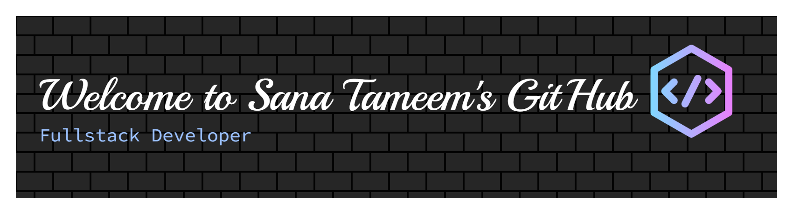

 

## 👩‍💻 About Me...

Full-Stack Web Developer from Kabul, Afghanistan , specializing in building efficient, scalable, and user-focused web applications. Computer Science graduate with academic background at Kabul University and the University of Applied Science and Technology (Tehran), along with training in full-stack web development from Microverse. Dedicated to clean code ⚙️, continuous learning 📚, and delivering high-quality digital solutions 💡. Open to opportunities in software development and collaboration 🤝.

 

## 💻 Languages & Technologies

 

## Interests
- :robot: AI and robotics.
- :camera: Capturing moments with my camera.
- :books: Getting lost in magical stories.
- :earth_americas: Discovering new cultures.
- :coffee: Trying different coffee blends.
- :walking: Peaceful walks in nature.
 

  

 

<h2 align="center"> Connect with Me</h2>

  
  
  

